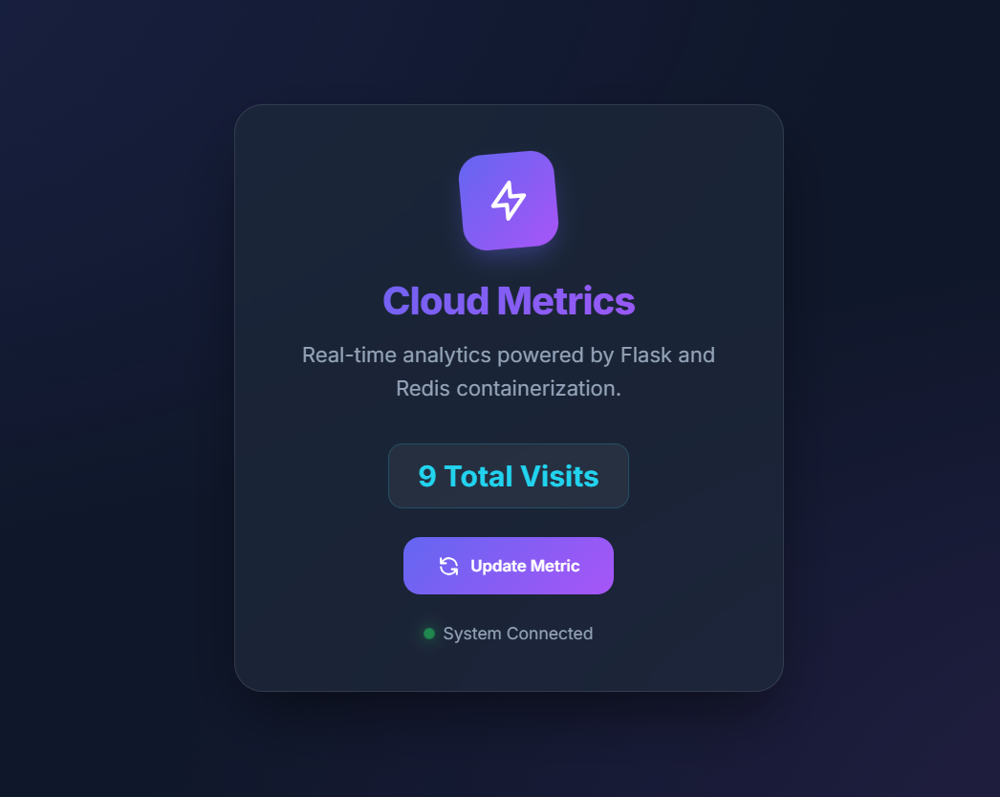
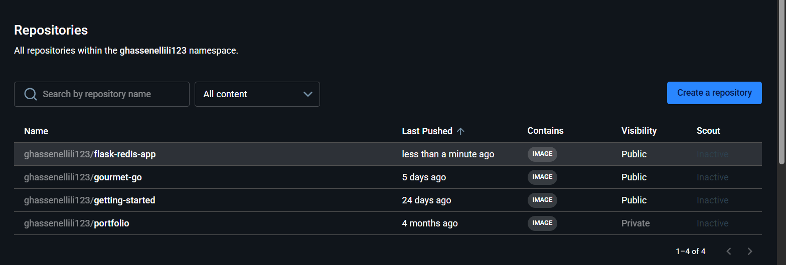

# 🐳 Flask + Redis + Nginx: Containerized Cloud App


A professional, containerized microservices application featuring a **Flask** backend, a persistent **Redis** database, and an **Nginx** reverse proxy. This project demonstrates high-availability architecture, internal networking security, and cloud-ready deployment patterns.

## 💎 Features

- **🚀 Premium UI**: Modern glassmorphism design with dark mode, Inter typography, and micro-animations.
- **⚡ Nginx Reverse Proxy**: High-performance entry point on port 80 for improved security and request handling.
- **🛡️ Secure Networking**: Redis is isolated within an internal `backend` network, inaccessible from the host.
- **💾 Data Persistence**: Named Docker volumes ensure your visit counter data survives container restarts.
- **🏥 Health Monitoring**: Integrated health checks for Redis to ensure system reliability.
- **📝 Structured Logging**: Centralized Python logging for real-time monitoring of app status.

---

## 🖼️ Application Interface



---

## 🛠️ Tech Stack

- **Backend**: Python 3.9 (Flask)
- **Database**: Redis (Alpine)
- **Proxy**: Nginx (Alpine)
- **Containerization**: Docker & Docker Compose
- **Design**: CSS3 (Glassmorphism, Animations)

---

## 🚀 Quick Start

### 1. Prerequisites
- [Docker Desktop](https://www.docker.com/products/docker-desktop/) installed and running.

### 2. Launch the Application
Clone the repository and run the following command in the project root:

```powershell
docker-compose up -d --build
```

### 3. Access the App
- **Web App**: [http://localhost](http://localhost) (via Nginx)
- **Direct Backend**: [http://localhost:5000](http://localhost:5000)

---

## 🌐 Cloud Deployment



### Docker Hub
The latest image is available on Docker Hub:
```bash
docker pull ghassenellili123/flask-redis-app:latest
```

### AWS Elastic Beanstalk
To deploy to AWS:
1. Initialize EB: `eb init -p docker flask-redis-app`
2. Create environment: `eb create flask-redis-env`

---

## 📁 Project Structure

```text
├── imagedocker.png     # 3D Architecture Diagram
├── imageUI.png         # App Interface Preview
├── imageDockerHb.png   # Docker Hub Repository Mockup
├── app.py              # Flask logic & logging
├── Dockerfile          # Web container instructions
├── docker-compose.yml  # Multi-container orchestration
├── nginx.conf          # Reverse proxy configuration
├── requirements.txt    # Python dependencies
├── static/
│   └── index.css       # Premium Design System
└── templates/
    └── index.html      # Glassmorphism Template
```

---

## 📄 License
This project is licensed under the MIT License - see the LICENSE file for details.

---
*Created with ❤️ for the Cloud Computing & Virtualization Mini-Project.*
